# Tools Review & Improvement Opportunities

**Last updated:** 2026-03-03  
**Data sources:** GA4 Reports snapshot (2025-12-03 to 2026-03-02), Search Console Performance export (2026-03-03), Search Console Coverage export (thetool.guru-Coverage-2026-03-03)

---

## 0. Search Console Coverage (Indexing) — FIXED

**Source:** `thetool.guru-Coverage-2026-03-03` (Critical issues / Non-critical issues / Chart).

| Reason | Source | Pages | Status |
|--------|--------|-------|--------|
| Not found (404) | Website | 244 | **Fixed** (see below) |
| Page with redirect | Website | 2 | OK (intentional redirects) |
| Alternate page with proper canonical tag | Website | 1 | OK (canonical working) |
| Crawled - currently not indexed | Google systems | 76 | Monitor (quality/priority) |
| Discovered - currently not indexed | Google systems | 16 | Normal (crawl backlog) |

**Root cause of 244 × 404:** The sitemap index (`/sitemap-index.xml`) references `/sitemap-tools.xml`, which was built from **all** tools (including unbuilt “coming soon” tools). Those unbuilt URLs have no route, so they return 404. Google discovered them via the sitemap and reported them as “Not found (404)”.

**Fix applied:** `frontend/src/app/sitemap-tools.xml/route.js` now uses `getBuiltTools()` instead of `getAllToolsForSitemap()`, so only live tool pages are listed. After deploy:

1. Resubmit the sitemap index (or `/sitemap-tools.xml`) in Google Search Console.
2. Use “Validate fix” for the “Not found (404)” issue in Coverage so Google can drop those URLs.
3. Over time, “Not indexed” counts should improve as Google recrawls and stops requesting unbuilt URLs.

**Chart takeaway:** Indexed pages are in the ~24–28 range; “Not indexed” was ~336–339. The 404 fix stops new 404s from the sitemap; the “Crawled - currently not indexed” (76) and “Discovered - currently not indexed” (16) are separate (crawl budget / quality) and can be improved with content and internal linking.

---

## 1. Executive summary

| Metric | Count |
|--------|--------|
| **Total tools (in config)** | ~100 |
| **Built (have page + component)** | ~87 |
| **Unbuilt (coming soon)** | ~60+ |
| **Categories** | 14 |

**What’s working:** Most built tools have a consistent layout (Header, Body, tool component, ToolContentSection). Top tools (Gradient Maker, Base64, PDF Editor, Color Converter, etc.) get meaningful traffic. Search Console shows impressions for many tool and blog URLs; brand queries (“tool guru”) already drive clicks.

**Main gaps:** (1) ~~URL search param on `/tools`~~ fixed. (2) ~~Sitemap includes only high-priority/featured tools~~ fixed (all built tools in sitemap). (3) **Indexing:** 244 URLs were “Not found (404)” because `/sitemap-tools.xml` listed unbuilt tools — **fixed** (sitemap-tools now lists only built tools). (4) ~~Some tool pages have minimal metadata (no canonical/full OG)~~ fixed (all built tool pages have full metadata). (5) Many pages have Search Console impressions but 0 clicks—title/snippet and relevance improvements can convert them. (6) ~60 unbuilt tools; several high-priority (e.g. PDF to Word, video/audio converter) are still missing.

### Improvement flow (overview)

```mermaid
flowchart LR
  subgraph quick [Quick wins]
    A[URL search on /tools]
    B[Sitemap all built]
    C[Metadata audit]
    D[Related tools block]
  end
  subgraph retention [Retention and SEO]
    E[Blog when no post]
    F[Structured data]
    G[More blog posts]
  end
  subgraph best [Best performers]
    K[GA top tools list]
    L[Pattern checklist]
    M[Emulate for others]
    N[Improve top tools]
  end
  subgraph future [Future]
    H[Unbuilt high priority]
    I[Unbuilt medium]
    J[New tool ideas]
  end
  quick --> retention
  retention --> best
  best --> future
```

---

## 2. Low-hanging fruit (easy, high impact)

Use the checkboxes to track progress.

- [x] **URL search param on /tools** — Header links to `/tools?search=...` but `ToolsPageClient` never reads `search` from the URL. Users landing with `?search=pdf` see all tools and an empty search box.  
  **Fix:** Pass `searchParams` from `frontend/src/app/tools/page.js` into `ToolsPageClient` and initialize `searchQuery` from `searchParams.get('search')`.  
  **Impact:** UX + retention. *(Done: tools page passes initialSearch; ToolsPageClient uses it.)*

- [x] **Sitemap includes all built tools** — `frontend/src/app/sitemap.js` only includes tools with `priority >= 0.7` or `featured`. Many built tools are missing.  
  **Fix:** Include all built tools in sitemap with appropriate `priority` / `changeFrequency`.  
  **Impact:** SEO + organic. *(Done: sitemap now uses getBuiltTools() for all built tools.)*

- [x] **Metadata consistency on tool pages** — Some pages (e.g. coin-flipper) have minimal metadata (no `alternates.canonical`, incomplete OG/Twitter).
  **Fix:** Audit all tool pages and add full metadata using the pattern in `frontend/src/app/tools/password-generator/page.js`.
  **Impact:** SEO + sharing. *(Done: All built tool pages now have alternates.canonical, full openGraph, and full twitter; script `frontend/scripts/add-full-metadata.js` used for batch + 7 manual for minimal-OG-only pages.)*

- [x] **Placeholder verification codes in layout** — `frontend/src/app/layout.js` uses `your-google-verification-code`, `your-yandex-verification-code`, etc.  
  **Fix:** Replace with real verification meta tags or remove placeholders.  
  **Impact:** SEO/setup clarity. *(Done: placeholders removed; comments added for adding real codes.)*

- [x] **Tools dropdown opens in new tab** — In `frontend/src/app/components/layout/Header.js`, the Tools button uses `window.open('...', '_blank')`.  
  **Fix:** Use a normal `Link` to `/tools` (or keep dropdown only, same tab).  
  **Impact:** UX. *(Done: Tools trigger is now a Link to /tools.)*

- [x] **Blog section when no post** — Tool pages that call `blogService.getPostBySlug(...)` with no matching slug may show an empty/broken “Learn more” section.  
  **Fix:** Only render `ToolBlogPost` when `post` is non-null; optionally show “Related tools” when no post.  
  **Impact:** UX + retention. *(Done: all 10 tool pages that use ToolBlogPost now wrap the section in {post && (...)}.)*

- [x] **Related tools on every tool page** — `getRelatedTools()` exists in `frontend/src/lib/tools.js`.  
  **Fix:** Ensure every tool page includes a “Related tools” section (by category).  
  **Impact:** Retention. *(Done: RelatedToolsSection added; every tool page uses `<RelatedToolsSection toolId="slug" />`.)*

---

## 3. Top performing tools (from Google Analytics)

**Source:** GA4 Reports snapshot. **Period:** 2025-12-03 to 2026-03-02.  
*Excluding homepage, “Page Not Found”, and referral-only rows (e.g. leadsgo.io).*

| Rank | Page title (tool) | Views | Active users | Bounce rate (approx) |
|------|-------------------|-------|--------------|------------------------|
| 1 | Gradient Maker | 137 | 138 | 23% |
| 2 | All Tools | 91 | 34 | 16% |
| 3 | Base64 Encoder/Decoder | 61 | 26 | 14% |
| 4 | PDF Editor | 39 | 15 | 7% |
| 5 | Color Converter | 27 | 14 | 7% |
| 6 | Website Speed Test | 24 | 11 | 8% |
| 7 | Image Resizer | 20 | 5 | — |
| 8 | Redirect Checker | 20 | 10 | 9% |
| 9 | cURL Tool | 20 | 10 | 42% |
| 10 | Timestamp Converter | 19 | 10 | 10% |
| 11 | JWT Decoder | 16 | 9 | 22% |
| 12 | Text Case Converter | 15 | 9 | 33% |
| 13 | Binary Encoder/Decoder | 12 | 6 | 43% |
| 14 | Weight Converter | 12 | 6 | — |
| 15 | Coin Flipper, Meta Tag Analyzer, Password Generator, SSL Checker, URL Encoder, Website Screenshot | 10 each | 4–6 | varies |

**Note:** “Page Not Found” had 238 views — worth tracking 404s and fixing broken links or redirects.

**Traffic mix (GA):** Direct 670, leadsgo.io referral 500, Bing organic 43, Google organic 25. Growing Google/organic is a clear opportunity.

---

## 4. Search Console: top pages and opportunities

**Source:** Search Console Performance export (thetool.guru). **Export date:** 2026-03-03.

### Top pages by clicks (tool pages)

| Page | Clicks | Impressions | CTR | Avg position |
|------|--------|-------------|-----|--------------|
| Homepage | 38 | 1,701 | 2.23% | 9.2 |
| /tools/file-size-converter | 6 | 145 | 4.14% | 14.9 |
| /tools/password-generator | 2 | 16 | 12.5% | 8.9 |
| /tools/base64 | 1 | 135 | 0.74% | 30 |
| /tools/decision-maker | 1 | 9 | 11.11% | 10.9 |
| /tools/tip-calculator | 1 | 8 | 12.5% | 57 |

### High opportunity (impressions but 0 clicks)

These URLs already get impressions; improving titles, descriptions, and relevance can turn them into clicks.

| Page | Impressions | Avg position | Action idea |
|------|--------------|--------------|-------------|
| /tools | 210 | 9.3 | Stronger title/snippet for “All Tools” |
| /tools/base64 | 135 | 30 | Improve snippet; position is weak |
| /tools/square-unit-price-calculator | 70 | 38.3 | Target “price per square meter” type queries |
| /blog/getting-started-with-base64-encoding | 33 | 50.2 | Internal links from base64 tool; refresh meta |
| /tools/pdf-merger | 15 | 4.5 | Position is strong; test title/description for CTR |
| /tools/json-formatter | 15 | 54.9 | Target “json formatter” queries |
| /tools/number-base-converter | 14 | 5.6 | Improve snippet |
| /tools/hash-generator | 14 | 6.9 | Improve snippet |
| /tools/robots-tester | 13 | 6.2 | Improve snippet |
| /tools/redirect-checker | 11 | 14.3 | Improve snippet |
| /blog/top-10-productivity-tools-for-developers | 11 | 67.6 | Refresh content/meta |

### Top queries (Search Console)

| Query | Clicks | Impressions | CTR | Position |
|-------|--------|-------------|-----|----------|
| tool guru | 24 | 1,007 | 2.38% | 8.1 |
| toolguru | 2 | 253 | 0.79% | 4.6 |
| base64 guru | 0 | 47 | 0% | 41.4 |
| [guru tool] | 0 | 32 | 0% | 73.2 |
| tools guru | 0 | 29 | 0% | 14.8 |
| guru base64 | 0 | 13 | 0% | 29.1 |
| base64 encoder | 0 | 5 | 0% | 106.6 |
| json formatter and validator | 0 | 4 | 0% | 110.5 |
| file size conversion | 0 | 6 | 0% | 62.3 |
| price per square meter | 0 | 5 | 0% | 95.2 |

**Opportunity:** Create or refine content and meta for base64, json formatter, file size conversion, and “price per square meter” / square-unit-price to capture these queries.

---

## 5. Patterns that best performers share (checklist)

Use this checklist when auditing or building tool pages so they match the best performers (e.g. Gradient Maker, Base64, PDF Editor, Color Converter).

- [x] **Full metadata:** `title`, `description`, `keywords`, `alternates.canonical`, full `openGraph`, full `twitter`. *(Done for all built tool pages.)*
- [ ] **Rich ToolContentSection:** features, how-to steps, use cases, tips, FAQ (all filled, not placeholder).
- [x] **Matching blog post (when applicable):** slug in blogService; ToolBlogPost block only when post exists. *(Done: blog block only renders when post exists.)*
- [ ] **Clear primary CTA:** one main action (e.g. “Generate”, “Encode”, “Convert”) and visible copy/download button.
- [x] **Related tools block:** “Related tools” section using `getRelatedTools()` by category. *(Done: every tool page has RelatedToolsSection.)*
- [x] **No broken or empty sections:** no “Learn more” with null post; no missing images/links. *(Done: ToolBlogPost wrapped in {post && (...)}.)*

**Reference implementations:** `frontend/src/app/tools/password-generator/page.js`, `frontend/src/app/tools/base64/page.js`.

---

## 6. Emulate best performers for other tools

For tools that are **not** in the top 15 by GA views (or have 0 clicks in Search Console), bring them in line with the checklist above.

**Priority order:**

1. Tools with **high Search Console impressions but 0 clicks** (see table in §4): improve title and meta description first.
2. Tools with **low GA views** but high business/SEO priority (e.g. json-formatter, hash-generator, pdf-merger): add or complete ToolContentSection, FAQ, canonical/OG, and related tools.
3. Tools with **minimal metadata** (e.g. coin-flipper, other simple tools): add full metadata and related tools.

**Audit:** For each built tool page, check presence of canonical, full OG/twitter, ToolContentSection (with FAQ), related tools, and conditional blog block. Log gaps in a spreadsheet or in this doc and fix in batches.

**Audit done (batch 1):** number-base-converter, file-size-converter, and binary-encoder were missing their page component body (only metadata + default export). Added full page with ToolContentSection (features, howToUse, useCases, tips, faq) and RelatedToolsSection. hash-generator: added 4th FAQ (MD5). pdf-merger: updated FAQ to state limit of 20 PDFs and 15MB per file. json-formatter, pdf-merger, redirect-checker, robots-tester already had rich ToolContentSection + FAQ.

**Audit done (batch 2):** Same fix (full page + ToolContentSection + FAQ) applied to: uuid-generator, rot13-encoder, hex-encoder, url-encoder, csv-to-json, dice-roller, timestamp-converter, html-encoder, jwt-decoder, random-number-generator, text-case-converter.

**Still to do (metadata-only, no page body):** email-validator, energy-converter, length-converter, meta-tag-generator, password-strength-checker, percentage-calculator, power-converter, pressure-converter, regex-tester, speed-converter, square-unit-price-calculator, temperature-converter, time-zone-converter, unit-converter, volume-converter, website-speed-test, weight-converter. Add the same page structure + ToolContentSection + FAQ for each.

---

## 7. Make the best tools even better

Ideas focused on **top performers** (Gradient Maker, Base64, All Tools, PDF Editor, Color Converter, Website Speed Test, etc.):

| Idea | Effort | Notes |
|------|--------|--------|
| Add or expand blog posts for top tools | M | Base64, PDF Editor, Color Converter, Gradient Maker — match slugs in blogService and add ToolBlogPost where missing. |
| Add SoftwareApplication / HowTo structured data per tool | M | Improves rich results and SEO; start with top 10 tools. |
| Internal linking from blog to tools and between tools | S | Link from “getting-started-with-base64-encoding” and similar posts to the matching tool and related tools. |
| Improve Core Web Vitals on heavy tool pages | M | Image lazy-load, reduce main-thread work; focus on PDF/Image tools if LCP or INP are weak. |
| A/B test CTA copy or placement of “Related tools” | L | Optional; after baseline improvements are done. |
| Fix 404s | S | Investigate “Page Not Found” (238 GA views); fix or redirect. |

---

## 8. Functionality and ease of use

**API-backed tools (ensure clear loading/error states):**  
DNS Lookup, WHOIS Lookup, SSL Checker, Website Speed Test, HTTP Headers Checker, Redirect Checker, Meta Analyzer, Robots Tester, Website Screenshot, cURL tool (and any other that call `frontend/src/app/api/*`).  
Verify: spinner/loading state, error message when API fails, no blank screen on CORS/network errors.

**Client-only tools:**  
Most others (Base64, Password Generator, JSON Formatter, converters, etc.). Quick check: copy buttons work, labels are clear, layout is usable on mobile.

**Consistency:**  
All built tool pages should follow the same layout: Header, Body, tool component, ToolContentSection, optional blog/related. No page should break when optional data (e.g. blog post) is missing.

---

## 9. SEO and organic traffic

- **Structured data:** Add `SoftwareApplication` or `WebApplication` (and `HowTo` where relevant) per tool; start with top 10. Document as follow-up task.
- **Canonical + OG:** Covered in low-hanging fruit (§2); after audit, list any pages still missing canonical here.
- **Blog content:** Add tool-specific posts for high-impression tools (base64, json formatter, file size converter, square unit price, pdf merger, hash generator). Ensure slugs exist in blogService and ToolBlogPost is used only when post exists.

---

## 10. Unbuilt tools (future steps)

Full list is in `frontend/src/lib/tools.js` (search for `built: false`). Below is a grouped subset.

### High priority (featured or priority ≥ 0.7)

| ID | Name | Notes |
|----|------|--------|
| pdf-compressor | PDF Compressor | priority 0.8; high demand |
| pdf-to-word | PDF to Word Converter | priority 0.7; high demand |
| video-converter | Video Converter | priority 0.7; needs backend or Web APIs |
| plagiarism-checker | Plagiarism Checker | priority 0.7; likely needs API |
| grammar-checker | Grammar Checker | priority 0.7; likely needs API |
| code-beautifier | Code Beautifier | priority 0.7; client-side possible |

### Medium priority (good demand or priority 0.5–0.6)

| ID | Name | Notes |
|----|------|--------|
| markdown-editor | Markdown Editor | client-only; preview + export |
| sql-formatter | SQL Formatter | client-only; format/highlight |
| sha-generator | SHA Hash Generator | client-only; extend hash-generator or new |
| text-to-speech | Text to Speech | browser Web API or external API |
| speech-to-text | Speech to Text | browser Web API or external API |
| broken-link-checker | Broken Link Checker | needs server or proxy |
| website-uptime-monitor | Website Uptime Monitor | backend/cron |
| favicon-generator | Favicon Generator | client-side canvas/export |
| word-to-pdf | Word to PDF | complex; library or API |
| excel-to-pdf | Excel to PDF | complex; library or API |
| epub-converter | EPUB Converter | library or API |
| code-minifier | Code Minifier | client-side possible |
| color-palette-generator | Color Palette Generator | client-only |
| audio-converter | Audio Converter | Web APIs or backend |
| screenshot-tool | Screenshot Tool | you have website-screenshot; alias or merge? |

### Lower priority (nice-to-have)

| ID | Name |
|----|------|
| ip-lookup | IP Address Lookup |
| dockerfile-generator | Dockerfile Generator |
| api-doc-generator | API Documentation Generator |
| bcrypt-generator, aes-encryptor, rsa-generator | Crypto tools |
| port-scanner | Port Scanner |
| email-header-analyzer | Email Header Analyzer |
| subdomain-enumerator | Subdomain Enumerator |
| box-shadow-generator | Box Shadow Generator |
| border-radius-generator | Border Radius Generator |
| font-pairing-generator | Font Pairing Generator |
| icon-generator | Icon Generator (and others in tools.js) |

### Implementation notes

- **Client-only (no backend):** markdown-editor, sql-formatter, box-shadow-generator, border-radius-generator, font-pairing-generator, color-palette-generator, favicon-generator, code-beautifier, code-minifier. Add `page.js`, component, set `built: true`.
- **Needs API/backend:** text-to-speech, speech-to-text, plagiarism-checker, grammar-checker, broken-link-checker, website-uptime-monitor, ip-lookup. Define API or use third-party; then build UI.
- **Heavy (conversion):** pdf-to-word, word-to-pdf, excel-to-pdf, video-converter, audio-converter. Evaluate browser libraries vs server-side; scope as larger projects.

---

## 11. New tools to add (optional)

- **Gap from Search Console queries:** “base64 encoder”, “json formatter”, “file size conversion”, “price per square meter”, “random number generator” — you already have tools for these; focus on **discoverability and meta** first. If you add new tools, align with backend keyword suggestions (`backend/` scripts).
- **Backend alignment:** Use `backend/README.md` and keyword/trending scripts to list suggested tools; add as “candidates” with effort S/M/L here.

---

## 12. How to refresh this doc

- **GA:** Export from GA4 (Reports → Engagement → Pages and screens), filter by path containing `/tools/`, date range (e.g. last 90 days). Update the table in §3.
- **Search Console:** Export Performance → Pages and Queries. Update §4 (top pages, high-opportunity pages, top queries).
- **Unbuilt list:** Run `grep -B 12 "built: false" frontend/src/lib/tools.js` (or equivalent) and refresh §10 if you add/remove tools.

---

*End of document.*
